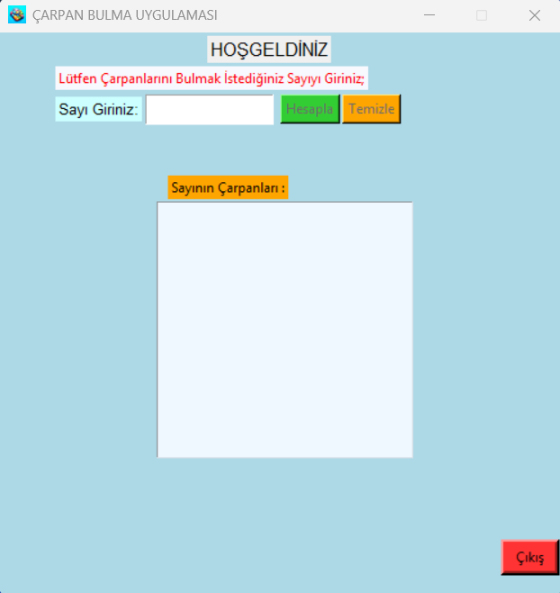

# 🔢 Çarpan Bulma Uygulaması  
*(Multiplier Finding Application)*

Bu proje, **Python ve Tkinter** kullanılarak geliştirilmiş bir masaüstü uygulamasıdır.  
Kullanıcının girdiği bir sayının **pozitif ve negatif çarpanlarını** hesaplayarak ekranda gösterir.

---

## 🧩 Özellikler

- ✔ Pozitif ve negatif sayı desteği  
- ✔ Sıfır için giriş kontrolü  
- ✔ Hatalı girişlerde uyarı mesajı  
- ✔ Dinamik buton aktif/pasif durumu  
- ✔ Basit ve anlaşılır arayüz  

---

## 🛠 Kullanılan Teknolojiler

- **Python 3.x**
- **Tkinter (GUI)**
- `math`
- `os`
- `sys`

---

## 📁 Proje Klasör Yapısı


---

## 🖥 Uygulama Arayüzü

<p align="center">
  
  
</p>

---

## ▶️ Uygulamayı Çalıştırma

### Python ile

Terminal veya komut satırında proje klasörüne girin:

```bash
python main.py

