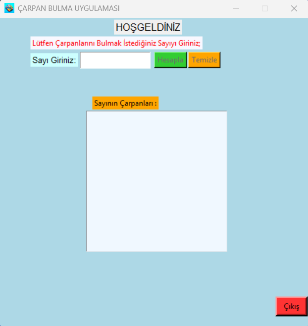
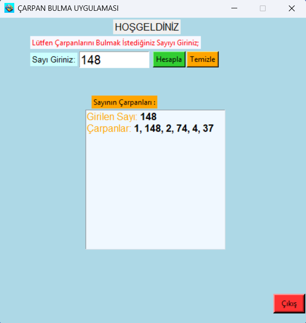
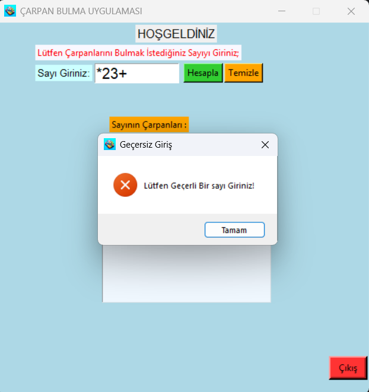

# 🔢 Multiplier Finding Application
*(Çarpan Bulma Uygulaması)* 

Bu proje, Python dili ve **Tkinter GUI kütüphanesi** ile geliştirilmiş bir masaüstü uygulamasıdır.
Uygulama, kullanıcı tarafından girilen sayının **pozitif ve negatif çarpanlarını hesaplamakta**, elde edilen sonuçları renkli ve sade bir arayüz aracılığıyla ekranda göstermektedir. Ayrıca hatalı girişler için kullanıcıyı bilgilendiren uyarı mekanizmaları içermektedir.

---

## 🧩 Özellikler

- ✔ Pozitif ve negatif sayı desteği  
- ✔ Sıfır için giriş kontrolü  
- ✔ Hatalı girişlerde uyarı mesajı  
- ✔ Dinamik buton aktif/pasif durumu  
- ✔ Basit ve anlaşılır arayüz  

---

## 🛠 Kullanılan Teknolojiler

- **Python 3.13.9**
- **Tkinter (GUI)**
- `math`
- `os`
- `sys`

---

## 🖥 Uygulama Arayüzü

  
  
  

---

